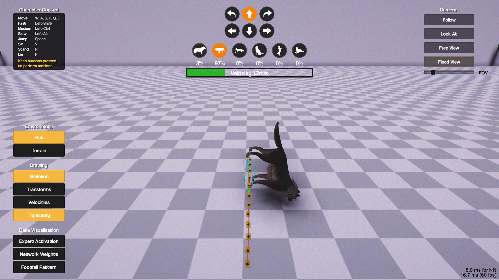

# MANN

This repository is made to export skeleton and keyboard input, following

"Mode-Adaptive Neural Networks for Quadruped Motion Control",

by He Zhang, Sebastian Starke et al. 

https://github.com/sebastianstarke/AI4Animation

## Export Skeleton

This project is based on Unity(C#), and is only tested on Windows

To start exporting, just run **\MANN\Unity\UnitySkeletonGeneratorEXE\UnitySkeletonGeneratorEXE.exe**,

and it will start a unity program which continuously save the skeleton and respective random sampled keyboard control.

## To Customize

All change is made in '\MANN\Unity\Assets\Demo\BioAnimation_Wolf.cs'

features includes:

- random sample keyboard control by win32 API
- each keyboard control last for 1~2s for control stability
- save txt file name by current time
- a .bat file to repeatedly collect data

## Data Form

keyboard input

(x,y,z) for 27 joints

e.g.

W

(0.0051, 1.0147, 0.0061)

(0.0051, 1.0147, 0.0061)

...

(0.0050, 0.9930, -0.0573)

(0.0025, 0.9493, -0.1626)

E

(0.0048, 0.7713, 0.0097)

(0.0048, 0.7713, 0.0097)
...
(0.0070, 0.7441, -0.0517)

(0.0025, 0.6999, -0.1559)

Q

(0.0036, 0.6379, 0.0127)

(0.0036, 0.6379, 0.0127)

...

(0.0068, 0.6094, -0.0480)

(0.0040, 0.5576, -0.1500)

